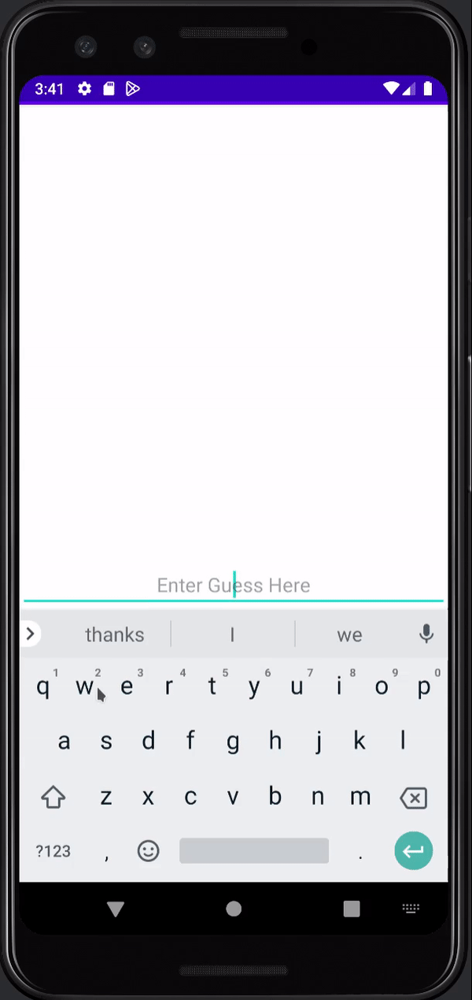

# Android Project 1 - *Wordle*

Submitted by: **Zachary Mull**

**4Wordle** is an android app that recreates a simple version of the popular word game [Wordle](https://www.nytimes.com/games/wordle/index.html). 

Time spent: **3** hours spent in total

## Required Features

The following **required** functionality is completed:

- [X] **User has 3 chances to guess a random 4 letter word**
- [X] **After 3 guesses, user should no longer be able to submit another guess**
- [X] **After each guess, user sees the "correctness" of the guess**
- [X] **After all guesses are taken, user can see the target word displayed**

The following **optional** features are implemented:

- [ ] User can toggle betweeen different word lists
- [X] User can see the 'correctness' of their guess through colors on the word 
- [X] User sees a visual change after guessing the correct word
- [X] User can tap a 'Reset' button to get a new word and clear previous guesses
- [X] User will get an error message if they input an invalid guess
    - instead of recieving an error it just prevents invalid guesses from being inputed
- [ ] User can see a 'streak' record of how many words they've guessed correctly.

The following **additional** features are implemented:

* [ ] List anything else that you can get done to improve the app functionality!

## Video Walkthrough

Here's a walkthrough of implemented user stories:

<!-- Replace this with whatever GIF tool you used! -->
GIF created with ...  [peek](https://github.com/phw/peek)

## Notes

Android Studio Just refused to run the app despite having no readable errors in the code and still wouldn't run after removing all but the default code. Eventually it just started working again. IDK what caused this as the errors weren't descriptive and I literally just left to go eat dinner while having the issue and came back to it working. 

## License

    Copyright [2023] [Zachary Mull]

    Licensed under the Apache License, Version 2.0 (the "License");
    you may not use this file except in compliance with the License.
    You may obtain a copy of the License at

        http://www.apache.org/licenses/LICENSE-2.0

    Unless required by applicable law or agreed to in writing, software
    distributed under the License is distributed on an "AS IS" BASIS,
    WITHOUT WARRANTIES OR CONDITIONS OF ANY KIND, either express or implied.
    See the License for the specific language governing permissions and
    limitations under the License.
